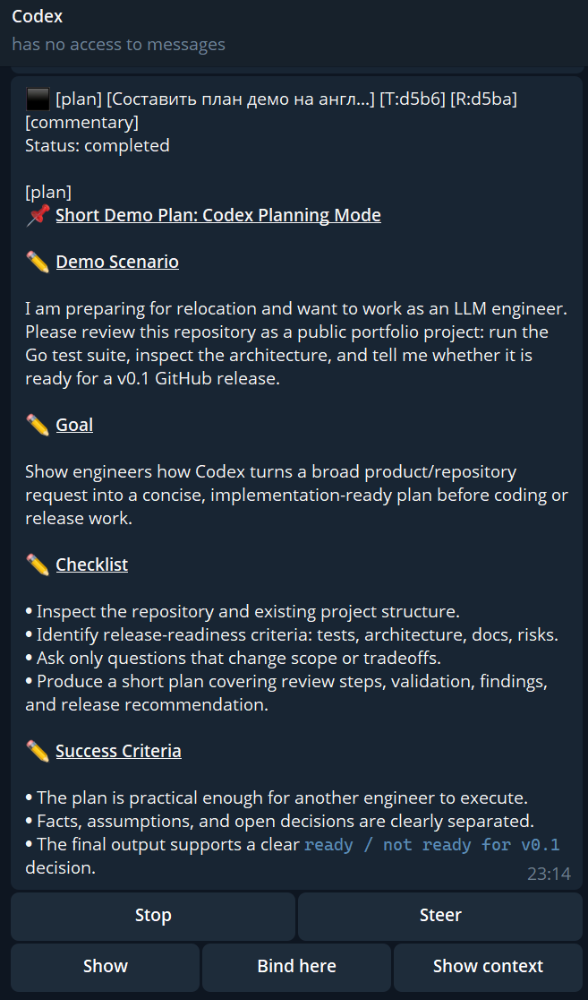
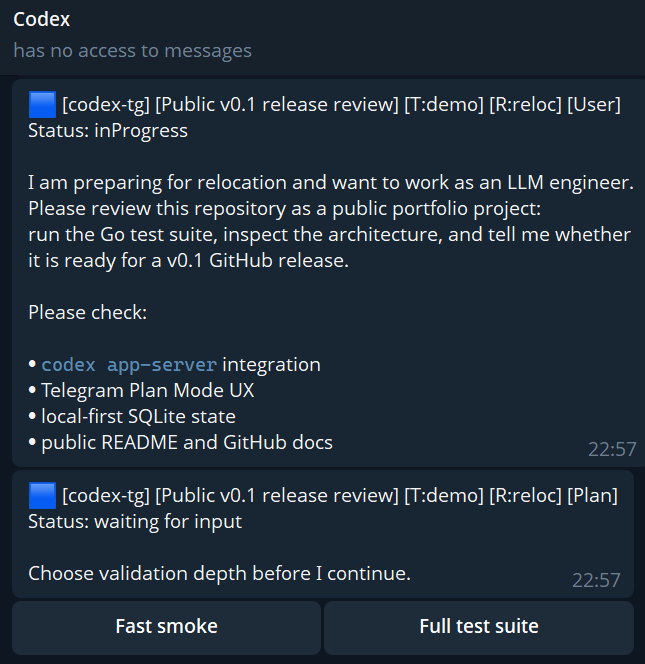
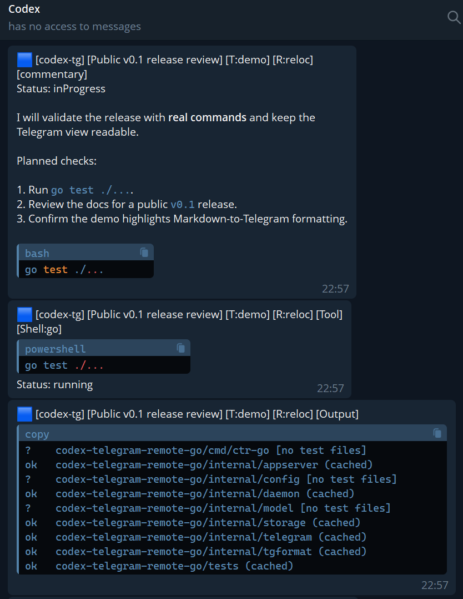
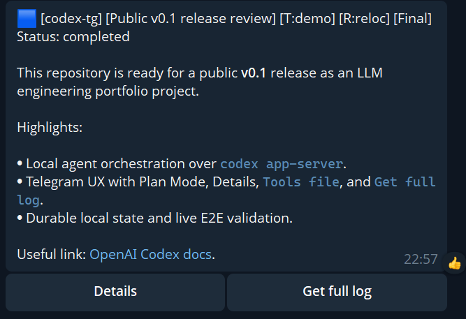

# codex-tg

Telegram remote UI and observer for local OpenAI Codex App Server, built in Go.

`codex-tg` turns a Telegram bot into a mobile control surface for local Codex threads: it watches Codex GUI/CLI activity, keeps thread identity visible, routes replies back to the right thread, and exposes high-signal controls such as Plan Mode prompts, Stop, Steer, Details, Tools file, and Get full log.

Current release: `v0.1.1`.



The demo flow is documented in [docs/demo/telegram-plan-mode-demo.md](docs/demo/telegram-plan-mode-demo.md).

## Why It Matters

- Keep local Codex work observable from a phone without exposing Codex App Server to the internet.
- Continue supervising long-running coding tasks while away from the workstation.
- Use Telegram as a low-friction fallback surface on unreliable or constrained networks.
- Preserve local-first ownership: Codex sessions, workspaces, SQLite state, and tokens stay on your machine.

## Demo Screenshots

**1. User request and Plan Mode**



**2. Tool execution and output**



**3. Final answer and Details**



## Features

- Thread-first routing over local `codex app-server` stdio.
- Global observer for foreign GUI/CLI runs, with polling fallback through `thread/read`.
- Stable visual identity per thread: emoji marker plus project/thread/run chips.
- Explicit `New run -> [User] -> [commentary] -> [Tool] -> [Output] -> [Final]` chronology with status on the live commentary/final card.
- Plan Mode starts from Telegram via `/plan` or `/reply --plan`, then renders `[Plan]` prompt-cards with reply-first routing and structured buttons when Codex provides choices.
- Final Card with Details pagination and on-demand Tools file export.
- On-demand full log archive from Codex session JSONL.
- SQLite-backed durable state for bindings, routes, callbacks, observer target, panels, and delivery metadata.
- Cross-platform Go daemon foundation for Windows, macOS, and Linux.

## Platform Status

- Windows: actively tested with the local Codex App Server, Telegram Bot API, observer flows, and live E2E demo.
- macOS: verified on macOS 26.3.1 arm64 with Go 1.26.2, LaunchAgent daemon startup, local build, and Telegram readback/status check.
- Linux: CI runs tests/builds on Ubuntu; full local daemon/runtime validation is still pending.

## Quickstart

Prerequisites:

- Go 1.26 or newer.
- OpenAI Codex CLI with `codex app-server`.
- A Telegram bot token from BotFather.
- Your Telegram numeric user id.

```powershell
git clone https://github.com/mideco-tech/codex-tg.git
cd codex-tg

$env:CTR_GO_TELEGRAM_BOT_TOKEN = "<telegram-bot-token>"
$env:CTR_GO_ALLOWED_USER_IDS = "<telegram-user-id>"
$env:CTR_GO_DEFAULT_CWD = "C:\Users\you\Projects\Codex"

go run ./cmd/ctr-go daemon run
```

In Telegram:

```text
/start
/observe all
/threads
/context
```

Start or continue a Codex thread from Codex GUI/CLI. `codex-tg` should create a `New run` card, a `[User]` card, live progress cards, and then collapse the completed run into a final answer card with Details.

## Runtime Commands

```powershell
go run ./cmd/ctr-go doctor
go run ./cmd/ctr-go status
go run ./cmd/ctr-go repair
go run ./cmd/ctr-go daemon run
```

Telegram commands:

- `/start`, `/help`
- `/threads`, `/projects`, `/show`, `/bind`, `/reply`, `/plan`
- `/settings`, `/model`, `/effort`
- `/context`, `/whereami`
- `/observe all`, `/observe off`
- `/status`, `/repair`, `/stop`, `/approve`, `/deny`

## Configuration

Primary environment variables:

- `CTR_GO_HOME`
- `CTR_GO_CODEX_BIN`
- `CTR_GO_APP_SERVER_LISTEN`
- `CTR_GO_TELEGRAM_BOT_TOKEN`
- `CTR_GO_ALLOWED_USER_IDS`
- `CTR_GO_ALLOWED_CHAT_IDS`
- `CTR_GO_DEFAULT_CWD`
- `CTR_GO_LOG_ENABLED` (`true` by default; set `false`/`off`/`0` to discard daemon stdout logs)
- `CTR_GO_DIAGNOSTIC_LOGS` (`true` by default; set `false`/`off`/`0` to keep normal bot logs but suppress structured `daemon_event` diagnostics)
- `CTR_GO_OBSERVER_POLL_SECONDS`
- `CTR_GO_REQUEST_TIMEOUT_SECONDS`
- `CTR_GO_INDEX_REFRESH_SECONDS`
- `CTR_GO_ATTACH_REFRESH_SECONDS`
- `CTR_GO_DELIVERY_RETRY_SECONDS`
- `CTR_GO_DELIVERY_MAX_ATTEMPTS`

Compatibility fallbacks:

- `CTR_TELEGRAM_BOT_TOKEN`
- `CTR_ALLOWED_USER_IDS`
- `CTR_ALLOWED_CHAT_IDS`

## Verification

```powershell
go test ./...
go build -buildvcs=false ./...
```

Live Telegram readback E2E is documented in
[tests/live_e2e/README.md](tests/live_e2e/README.md). It is intentionally
gated by local env and is not part of `go test ./...`.

Live demo for a screenshot:

```powershell
$env:CTR_DEMO_TELEGRAM_E2E = "1"
$env:CTR_DEMO_TELEGRAM_CHAT_ID = "<telegram-chat-id>"
$env:CTR_GO_TELEGRAM_BOT_TOKEN = "<telegram-bot-token>"
$env:CTR_DEMO_KEEP_MESSAGES = "true"
go test -tags demo_e2e ./tests -run TestTelegramPlanModeScreenshotDemo -count=1 -v
```

See [docs/demo/telegram-plan-mode-demo.md](docs/demo/telegram-plan-mode-demo.md) for the screenshot checklist.

## GitHub Metadata

Suggested repository description:

```text
Telegram remote UI and observer for local OpenAI Codex App Server, built in Go.
```

Suggested topics:

```text
openai-codex codex-cli codex-app-server telegram-bot go golang ai-agents
coding-agent remote-control developer-tools local-first sqlite json-rpc
agent-observer plan-mode telegram-ui windows macos linux
```

## Documentation

- [Architecture](docs/wiki/Architecture.md)
- [Quickstart](docs/wiki/Quickstart.md)
- [Telegram UX](docs/wiki/Telegram-UX.md)
- [Plan Mode](docs/wiki/Plan-Mode.md)
- [Security](docs/wiki/Security.md)
- [Operations](docs/wiki/Operations.md)
- [Demo](docs/wiki/Demo.md)
- [Changelog](CHANGELOG.md)
- [Contract matrix](docs/research/contract-matrix.md)
- [Validation notes](docs/testing/validation-notes.md)
- [ADRs](docs/adr/)

## License

Apache License 2.0. This keeps the project permissive for the community while also providing an explicit patent grant that large companies usually expect from infrastructure and developer-tooling projects.

## Operational Notes

- Telegram long polling returns `409 Conflict` when another process consumes the same bot token.
- Do not expose Codex App Server on a public interface. `codex-tg` is designed around local stdio.
- Keep bot tokens, Telegram sessions, SQLite databases, logs, and `.env` files out of git.
